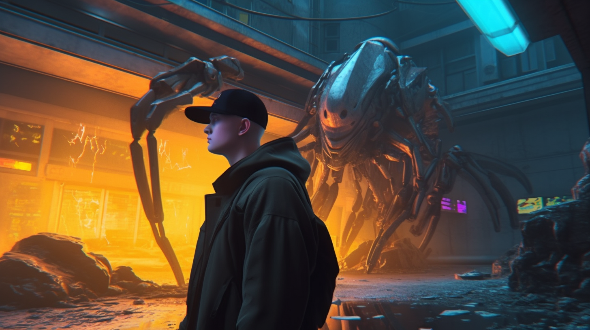

Привет, читатель!
Можешь звать меня Каменный, у меня есть высшее образование по информационной безопасности, на момент написания статьи работаю ментором на Киберполигоне в одной крупной компании. 

>Киберполигон - это специально созданная площадка для проведения симуляционных учений и тестирования средств защиты от кибератак. Такие площадки могут имитировать различные типы атак, уязвимости в информационных системах и сетях, различные варианты развития атак и многие другие сценарии. 

Простыми словами, составляю, реализую и автоматизирую кейсы по типу тех, что осуществляют злоумышленники. Только делаю я это на изолированной инфраструктуре, не причиняя никому вреда. Потом я иду в СЗИ и расследую то, чего натворил, чтобы составить список заданий для Blue Team инженеров, которые будут обучаться по этим заданиям пользоваться СЗИ. Да и в целом узнавать какие бывают атаки и как их обнаруживать.

Хочу развивать себя и всех рядом присутствующих, мне это нравится. Для начала научиться вести блог в этих ваших интернетах, а потом как-нибудь, когда-нибудь выступить в Лас Вегасе с докладом. Может конечно к тому времени, круче будет презентовать себя на китайском языке, но это совсем другая тема для разговора.

Что я преследую? Мои цели довольно корыстны - хочу развить свои писательские навыки, развить фантазию, которая, как оказалось, очень нужна при симуляции и придумывании нового сценария атаки. Самое главное для меня является то, что я хочу делиться тем, что знаю. Где-то читал, что делиться знаниями помогает в развитии. Что ж, приятный бонус.

Ниже, я откроюсь тебе, читатель, чтобы ты понимал с кем имеешь дело.
Довольно лонг лонгрид, поэтому вот тебе оглавление:

>1. Zero-knowledge
>2. Первая работа на линии SOC
>3. Разочарование и рост
>4. CERT
>5. Авария
>6. Госуха
>7. Частный SOC
>8. Настоящее
>9. Будущее

---

# Zero knowledge
Все началось довольно прозаично, я накатил Linux на свою домашнюю машину и начал с ним жить. Моим введением в мир ИТ началось с книги Куроуза "Нисходящий подход". Это такой облегченный Таненбаум, только рассказывать там начинают с прикладного уровня, а не с физического. Такой расклад мне понравился и я прочитал всю книгу взахлеб, а также сделал все лабы за пару месяцев. 

Мне особенно понравилась статья про Безопасность. Мне кажется благодаря ей я и решил изучать и кибербезопасность тоже.

Ходил по форумам, читал статьи, не понимал что происходит, запускал утилиты, работу которых я совсем не понимал. Скрипткиддился по полной.

В какой-то момент узнал про CTF. Я считаю это был второй шаг в становлении меня как специалиста. В онлайн-соревнованиях я не участвовал, а вот офлайн таски решал с удовольствием, читал райтапы, перерешивал.

---

# Первая работа на линии SOC
И вот в моем городе, совместно с моим университетом проходит форум карьеры. На нем была одна из немногих ИБ-компаний моего города, поэтому я решительно пошел на этот форум.

Проходя мимо всех стендов я уверенно шел к человеку занимающемуся набором персонала. Мы пообщались, я пересказал прошлый раздел данной статьи и... Мне назначили собеседование! 

Я считаю, что мне повезло, потому что на собеседовании были крайне простые вопросы, по типу "Чем UDP отличается от TCP?". Я прошел на позицию инженера первой линии мониторинга SOC.

SIEM, IRP, куча дашбордов, которые не вмещаются на трех мониторах и многое другое. Я был в восторге. Инциденты, фолзы, правила корреляции, уйма новой информации лилось в голову. Узнал про MITRE ATT&CK и очень уж мне понравилась матрица, но мне ужасно не нравилась рутина тикетов, в которой я буквально тонул, а что уж говорить про ночные дежурства...

--- 

# Разочарование и рост
Конечно же я хотел попасть в крутую CTF-команду, чтобы меня научили всяким крутым штукам:
>Как называется ваша ctf-команда и как туда попасть? - спросил я у тимлида
>Какая-какая команда..? - ошарашил меня тимлид

На линии были без понятия про соревнования для хакеров, кто-то вовсе не знал про MITRE, были и те кто даже Kali Linux не запускали на виртуальной машине! 

Я быстро соориентировался и начал проводить образовательные мероприятия: рассказал про MITRE, поиграл с коллегами в CTF, показал Metasploit и Burp Suite, и все прочие прелести того, с чем они, как мне казалось, должны были быть знакомы. Меня стали замечать, ко мне лично пришел руководитель CERT нашей компании и дал кипу материала для изучения: форензика, малвар анализ, IR. Также он мягко намекнул, что мне пора расти. Я принялся изучать. Моей любимой книжкой на ближайшее время стал "пришелец" - Practical Malware Analysis: The Hands-On Guide to Dissecting Malicious Software. Крайне рекомендую к прочтению всем будущим специалистам по анализу вредоносов, это отличный вход в эту область.

Спустя несколько месяцев я стал младшим инженером CERT.

---

# CERT
После того как я попал в самый технически-подкованный отдел (с синей стороны конечно же), я стал чувствовать себя намного увереннее. Общение с аналитиками напрямую, анализ реальных инцидентов, а не запусков PsExec администратором сети, реальные малварные кампании.

Моей первой малварю был SmokeLoader. Тогда он было особо популярен и интернет был в изобилии отчетов по анализу этого дроппера, поэтому анализ не составил особого труда.

Но анализ популярных семейств и написание детектов были пассивные задачи, когда не требуется помощь форензиков. Также, не удалось мне ускользнуть и от ночных дежурств - быть форензиком, значит быть готовым проснуться в час ночи, скачать образ на 200 Гб в течении пары часов (пока досыпаешь, конечно же) и начать его расследовать. Изучать артефакты: смотреть записи MFT-таблицы, AmCache & ShimCache, реестр с автозапуском, службы, узнавать как работает volatility и многое другое. Но самое "веселое" - получить "чистый образ, но потратить на него ночь и полутра. Незабываемо. 

---

# Авария
Это будет довольно короткий и грустный абзац - спустя полгода работы я попал в серьезную аварию на автомобиле и пролежал около полугода. После восстановления и возвращения в офис, я потерял связь с отделом - удаленка решает. Мне показалось, что я отделился от ребят. В своем городе из отдела я был единственным и мне было нелегко. В офисе моего города был переезд, и чтобы освободить места для вновь прибывающих инженеров (SOC сильно рос), я переехал на другой этаж. Отдел, работающий на этом этаже, был полностью переведен на удаленную работу. Казалось бы, счастье - весь этаж в моем распоряжении. Но не тут то было, даже чай не с кем попить, поболтать. Параллельно ко всему этому мне предложили другую должность и повышенную зарплату в другом месте. Мне было нелегко принять это решение, однако я согласился.

---

# Госуха
Как вы уже поняли, я попал в государственное учреждение. Я также продолжал работу форензиком, и сказать честно, первые пару месяцев работы были напряженными и интересными: проверки от ФСТЭК и ФСБ, пентесты, реальные атаки - с корабля на бал. Работать мне нравилось, к тому же полная удаленка, я "переехал" домой, мне вновь начало нравится.

Я также занимался расследованиями, когда это требовалось, но анализ вредоносов ушел на второй, нет, на третий или даже четвертый план. Это были крайне редкие вылазки, и те на файлы найденные в инфраструктуре. А какие вредоносные файлы могут быть найдены в госушной инфраструктуре? KMS, приправленный адварью фотошоп, новый торрент-клиент и иже с ними. Либо продвинутые APT-атаки, которые к тому времени я, будучи со знаниями джуна, попросту не мог увидеть, да и не увидел.

К моим задачам прибавилась обработка отчетов с индикаторами компрометации и автоматизация их обработки - я познакомился со STIX-отчетами, научился их генерировать, привык к питону. Спустя какое-то время работа стала волнообразной: проверка - куча работы, нет проверки - нет работы. И так на протяжении полугода. Я заскучал, перестал развиваться, вышел из ритма первых двух лет саморазвития на линии мониторинга и CERT, авария сыграла существенную роль. Да что там заскучал - загрустил. Понял, что надо что-то менять.

Составил резюме, выложил вакансию, получил первое предложение и сразу же за него ухватился - аналитик SOC.

---

# Частный SOC
Теперь я Старший аналитик инцидентов информационной безопасности, привычными словами - L3 аналитик SOC. Вновь вернулся на линию, но на пару позиций выше. Работа с внутренностями нового для меня SIEM, написание правил корреляции, подключение источников, разработка сценария выявления и реагирования на инциденты ИБ. Обошлось без бумажной волокиты, а может быть до нее я просто не дошел.

Настроился на рабочий режим, "вошел в состояние потока" и, случайно наткнулся на hh на крайне новую для меня вакансию - аналитик/ментор на Киберполигоне. Более того, компания, которая разместила данную вакансию, известна на рынке ИБ, занимает ТОП позиции. Для меня это сыграло решающую роль, потому что я понял, что не могу работать в **отделе ИБ**, я хочу работать в **компании в ИБ**.

---

# Настоящее
HR меня сильно запугала перед собеседованием, сказала что обычно руководитель направления выделяет по полтора-два часа на собеседование, гоняет по всем темам, возможно даст практическое задание. Я напрягся, но принял вызов.

И вот, проходит 20 минут моего подробного рассказа о себе и мой будущий (тогда я этого еще не знал) руководитель сообщает мне, что собеседование можно считать законченным и со мной свяжутся позже. Сказать, что я расстроился - ничего не сказать. Скосили после рассказа о себе, что еще может быть хуже, где я налажал? Недостаточный опыт работы? Не тот стек? Часто менял работу? Слишком болтливый? Разбился на тачке? Бред. Спустя 10 минут мне пишет мой HR с вопросом "...как так?.." А я что, я начал оправдываться, мол видимо не подхожу, рад был пообщаться.. А он имел ввиду, что из кучи негативных полуторачасовых собеседований, руководитель сразу пошел за офером после моего рассказа. Я почувствовал себя на высоте. Оффер в кармане.

По факту я стал Purple Team'ером: симулируешь атаку с красной стороны, разбираешь поэтапно, описываешь, расследуешь с синей стороны в СЗИ, пишешь поэтапно расследование. Материал для изучения падает в голову водопадом, ведь теперь вспоминаются все CTF-комнаты и машины, которые я читал и проходил, малварные отчеты, все это надо реализовывать. Расскажу про работу на конкретном примере в каком-нибудь из будущих постов.

---

# Будущее
Как вы могли заметить, я завел свой блог, более того, я хочу его вести. Разбирать малвары, их техники, писать про автоматизацию атак, в целом про кибербезопасность и многое другое, что может содержать блог по кибербезопасность. 