Приветствую, дорогой читатель!

В этой статье я проанализирую реальный сэмпл вредоносного ПО семейства Amadey, который довольно популярен в последнее время.

>_**Amadey** - это ботнет, который появился примерно в октябре 2018 года и продается примерно за 500 долларов на русскоязычных хакерских форумах. Он периодически отправляет информацию о системе и установленном AV-программном обеспечении на свой сервер C2 и проводит опросы для получения команд от него. Его основная функциональность заключается в том, что он может загружать другие полезные нагрузки (называемые "задачами") для всех или специально целевых компьютеров, скомпрометированных вредоносным ПО_

По трекеру any.run он занимает топовые позиции, а именно, второе и третье место, за 7 и 365 дней соответственно.
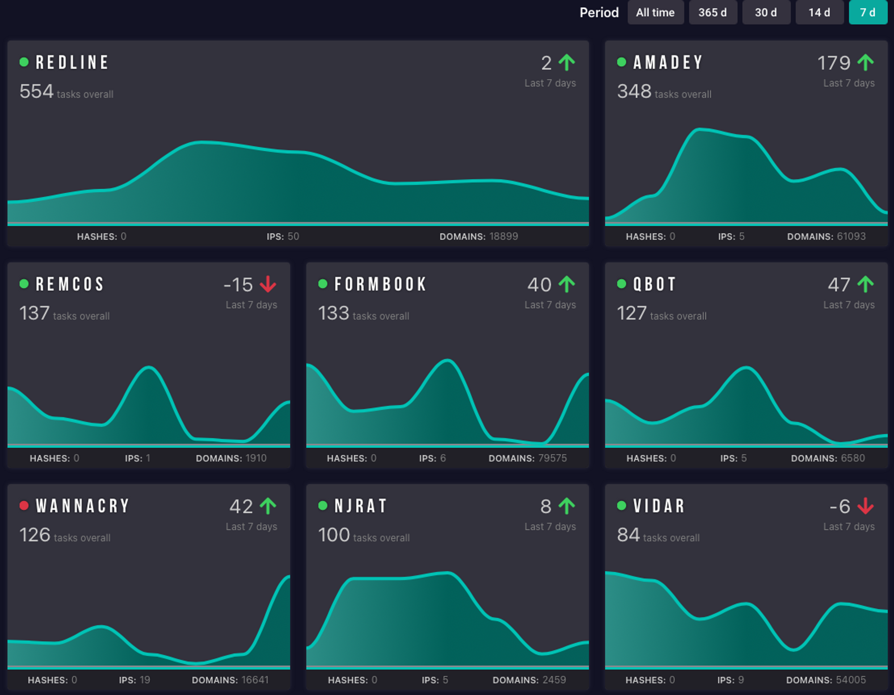
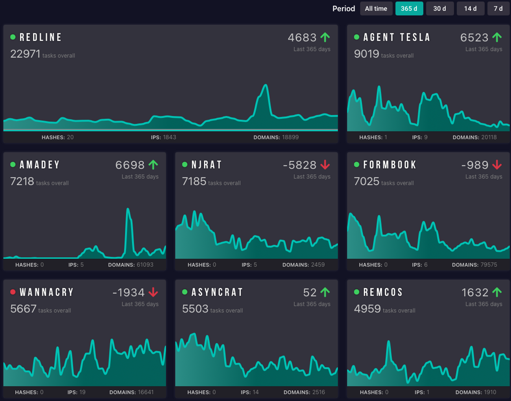

Хеши рассматриваемого мною сэмпла следующие:

- MD5: 3046ee18ca3ecf3655b704c65c595c72
- SHA-1: e50c175ca1120e600a0728b3ae771ea9e3ecaa73
- SHA-256: d5f14b56cd42d5ef42a59c6b1140de0fd19c4f53e6bab07979b941acd30a11e0

Обозначу основные пункты статьи:

1. Извлечение payload'a
2. Анализ импорта и строк
3. Расшифровка закодированных строк
4. Анализ вызываемых API-функций
5. Получение вторичных модулей
6. Вторая попытка расшифровки строк

---

# Начало анализа - DIE

Для начала посмотрим, что перед нами, а именно - загрузим целевой файл в утилиту Detect-it-Easy:
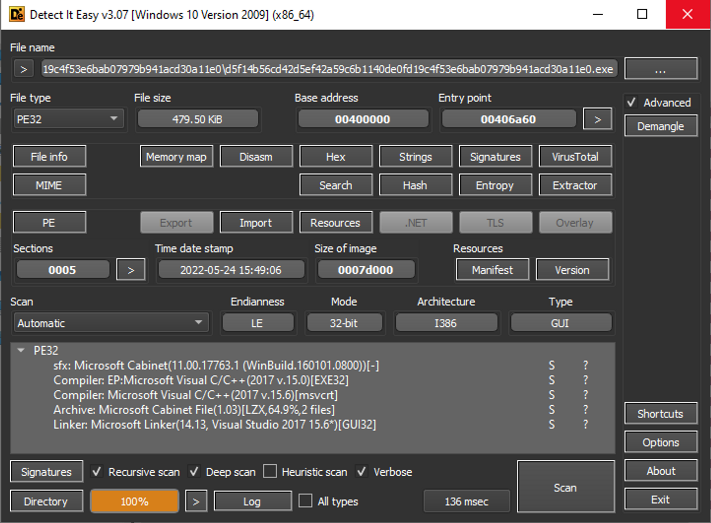

Мы прекрасно видим, что файл является 32-разрядным исполняемым файлом. Который в данном случае на самом деле является cab-архивом. По факту, это .zip, который может быть выполнен как EXE-файл. Извлечем содержимое архива обычным 7zip'ом.
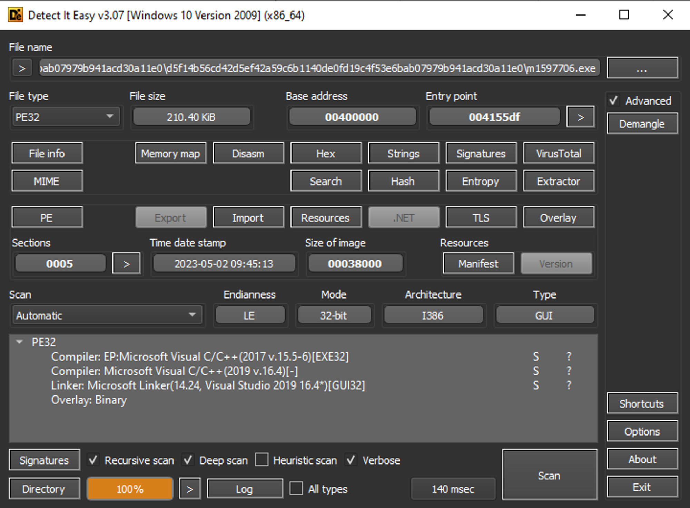

Хм, внутри еще один cab-архив и исполняемый файл. Попробуем разобраться с исполняемым файлом.
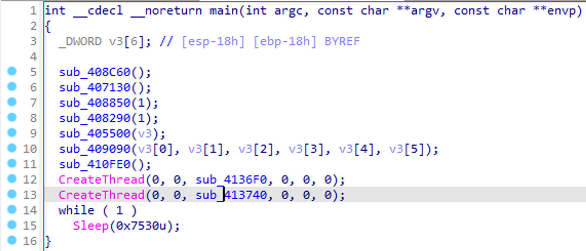

Это PE x32 файл, поэтому каким-нибудь dnSpy изучить его не получится, придется идти в IDA и иже с ней…

Будем все это дело сначала изучать в IDA Free, на момент написания статьи версия 8.2.

---

# Импорты и строки
Видим следующую картину, перед нами main-функция:
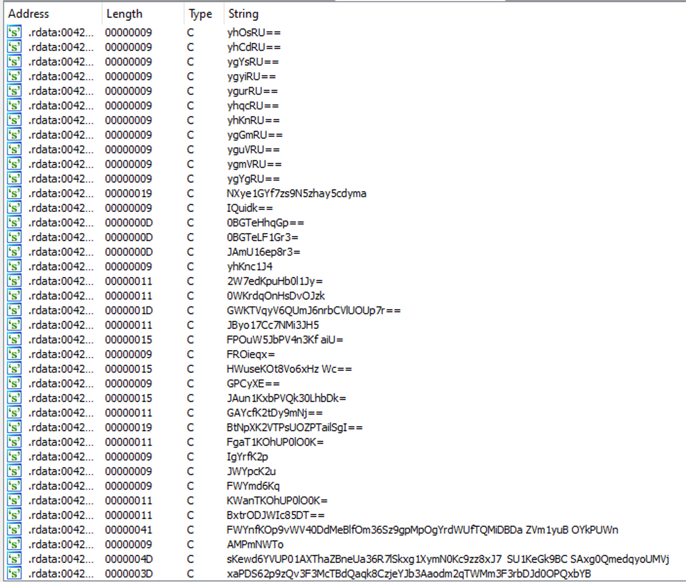

По опыту не сказал бы, что сильно заморачивались с упаковкой, да и энтропия не выше 6 на протяжении всех секций. Два создания потока и сон после них - вероятнее всего внутри функций потоков общение с С2 и получение команд. Узнаем позже, пока изучим что же творится под капотом у малвари.

Импортирует образец довольно скромный набор библиотек:

- advapi32
    
    RegSetValueExA - персистенс?
    
- kernel32
    
    CreateFileA - дропает что-то, трудяга
    
    CreateThread - уже видели
    
    CreateMutexA - зачем множить себя, не так ли?
    
    CreateProcessA - куда же без этого
    
    GetThreadContext - погодите-ка..
    
    SetThreadContext - ..очень похоже на..
    
    ResumeThread - ..внедрение кода!..
    
    ..и куча других легитимномалварных функций
    
- shell32
    
    ShellExecuteA - и что ты будешь этим запускать?
    
- wininet
    
    InternetOpen{X} и остальные - тут тоже все ясно, надо же как-то общаться с командным центром

Что ж, с импортом разобрались, даже предположили наличие инъекции кода модной техникой. А что строки? Может получится выудить С2 и заблокировать на периметре пораньше?
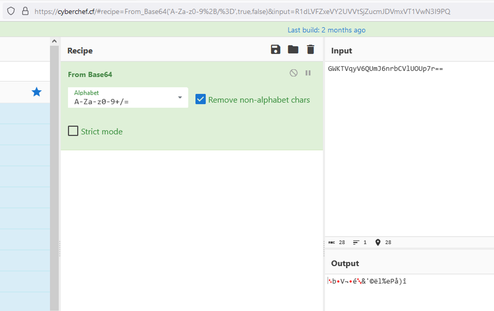

Какая красота! Рай для CTF-ера, сплошной Base64. Попробуем вбить одну из строк в КиберШеф, найдем и достанем конфиг и пойдем по своим более важным делам.
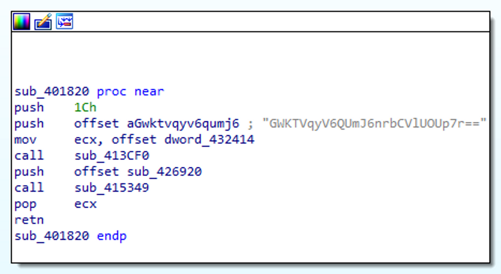

Что ж, неудача. Что-то кастомное. А если проследовать по x-ref'am и найти функцию которая декодит это барахло?
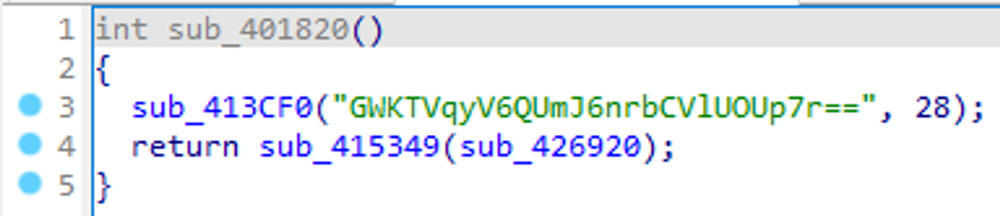

Ну и кому нравится С-подобный код:
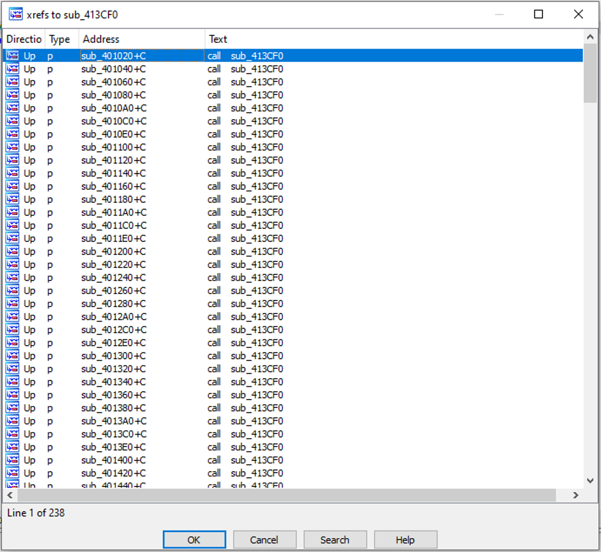

Очень похоже на то, что функция 413CF0 декодирует нашу строчку.. Как часто она вызывается? 
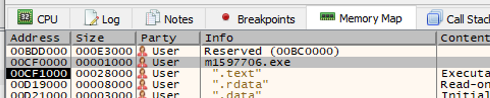

Аж 238 раз, похоже на декодирующую функцию.

---

# Расшифровка строк с x32dbg
Лень - двигатель чего-то там. Пойдем-ка мы в дебаггер и исследуем что у этой функции на выходе происходит, а то вдруг время зря теряем.

Расчехляем x32dbg, загружаем туда наш сэмпл, жмем F9, падаем в EntryPoint, перебазируем сэмпл в IDA и ставим бряк на ret-инструкцию целевой функции и смотрим что она вернет. Успели? Сейчас помедленнее.

С загрузкой сэмпла в дебаггер трудностей возникнуть не должно. Узнаем по какому адресу расположился целевой сэмпл с помощью карты памяти:

Проставим в IDA этот базовый адрес: Edit → Segments → Rebase program…

Адрес функции поменялся, что логично:
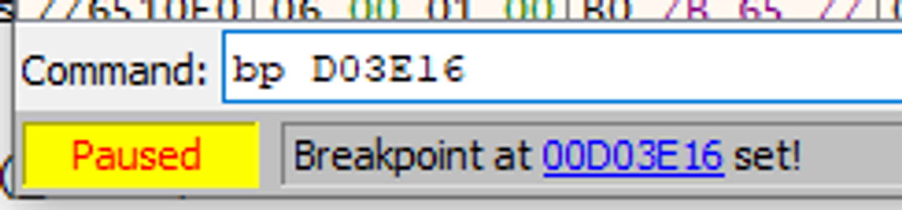

Теперь мы целимся на D03CF0, а если быть совсем точным, то на адрес возврата из функции. Как мы можем видеть, наше перебазирование успешно. так как код идентичен:
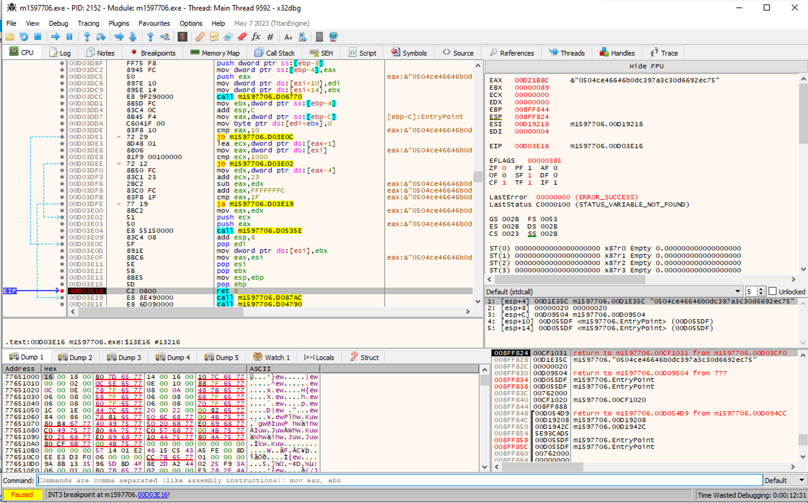

Ставим бряк на нужном нам адресе:
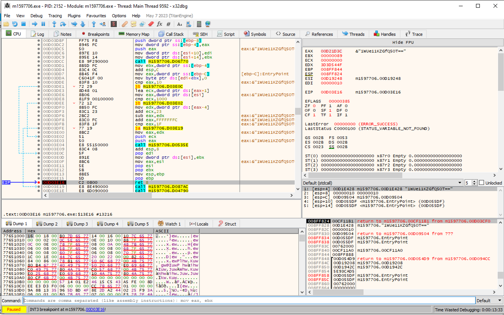

Первый запуск ничего толкового не дал, какой-то набор цифр с буквами (обратите внимание на регистр ЕАХ):
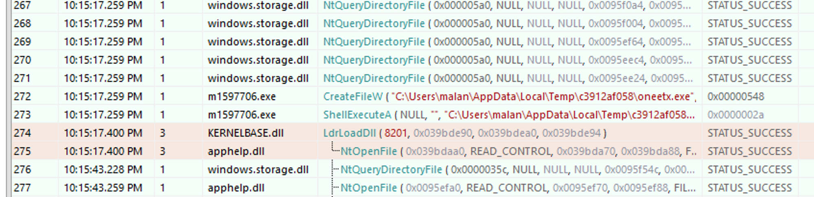

Спешу вас огорчить, последующие вызовы не дали ожидаемого результата - никаких осмысленных строк мы не встретим, только перечисление вышенайденных Base64-подобных:
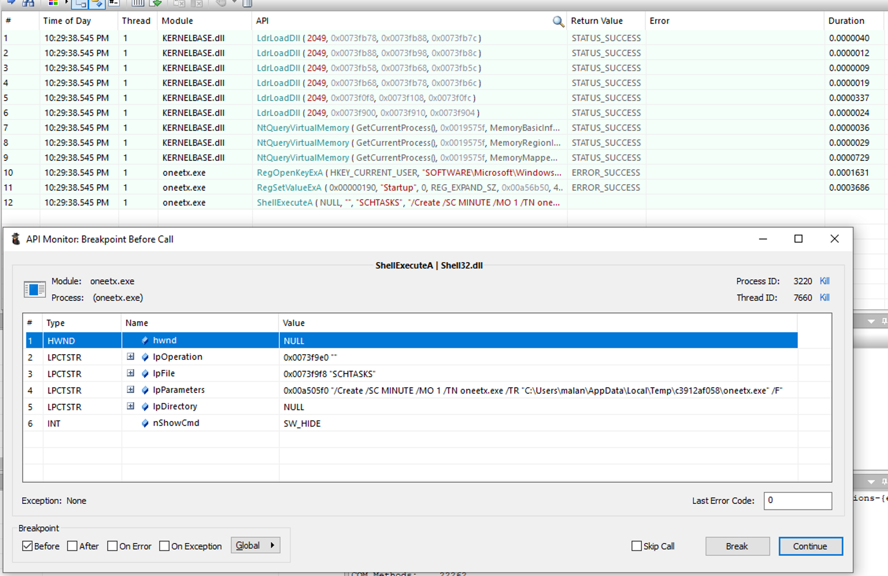

Что ж, эта функция не отвечает за декодирование строк, а скорее всего отвечает за копирование оных.

Давайте как-нибудь назовем эту функцию и примемся за изучение main-функционала.

---

# API-анализ
Мне по-прежнему лень изучать все вручную и я прибегну к такой замечательной утилите как API Monitor, чтобы увидеть что же делает целевой образец. Для начала я сделаю снэпшот и после этого изучусь за изучение образца.
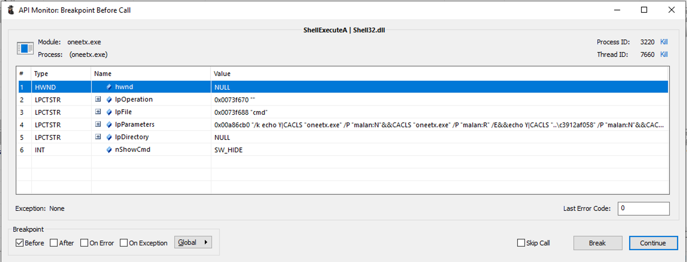

Забавно, в вызовах под номерами 272 и 273, которые по совместительству являются номерами строк за киберпреступления в УК РФ, программа действительно распространяется и запускается. Совпадение?..

Отступим от лирической части. Программа создает копию во временной папке пользователя и запускает новый процесс оттуда с помощью ShellExecuteA, настоящий же процесс завершается. Выше, в самом начале, программа возможно проверяет наличие оного файла в данной директории с помощью API-вызова CreateFileW. Путем нескольких запусков, я понял, что данный путь не является случайным - имя папки и файла зашиты. Вероятнее всего, перед нами довольно простая проверка. 

Попробуем запустить файл оттуда, откуда он должен запускаться и посмотрим теперь на его активность. Создадим папку, скопируем туда образец и переназовем его, а дальше снова пройдем в API Monitor.

Пам-пам-пам, а вот и закрепление, сразу в двух вариациях: и через реестр, и через планировщик заданий. Смотрим дальше.
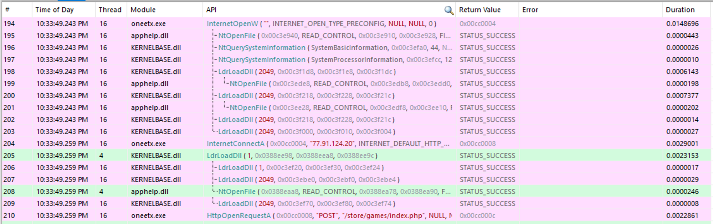

А здесь что? Манипуляции с DACL, через морально устаревший CACLS. Хорошо, идем дальше.
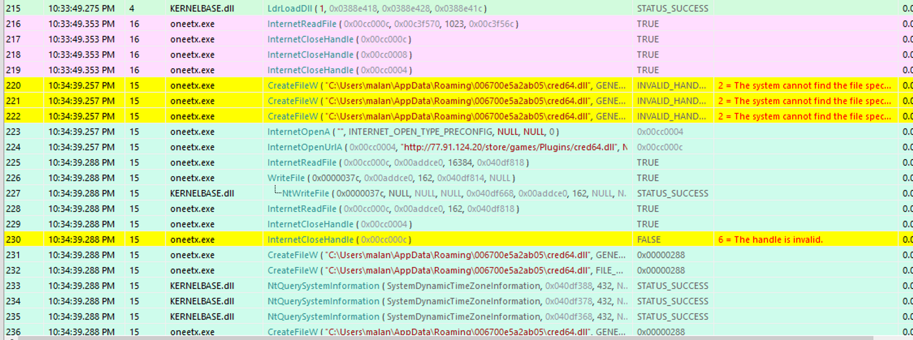

Бинго! Обращение на С2!
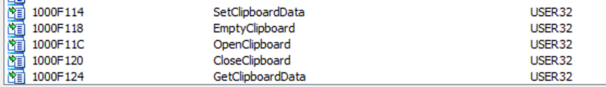

---

# Вторичные модули
Как вы уже догадываетесь, пока я писал абзац выше и добавлял скриншот, ВПО установило дополнительный модуль - cred64.dll и clip64.dll:
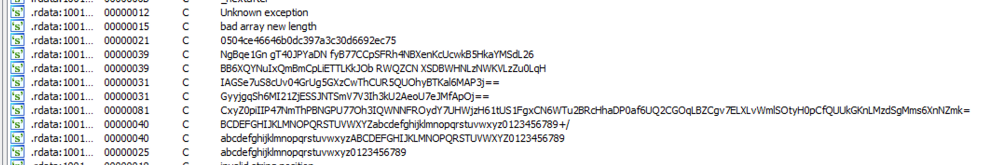

cred64.dll оказался обычным HTML-файлом, хотя запускался через rundll. Логично предположить, что это должно был быть второе семейство, так называемая полезная нагрузка, RedLine

clip64.dll же является PE-библиотекой с довольно скромным набором импортируемых функций и намекающим названием. Это клиппер - spyware нацеленный на буфер обмена.
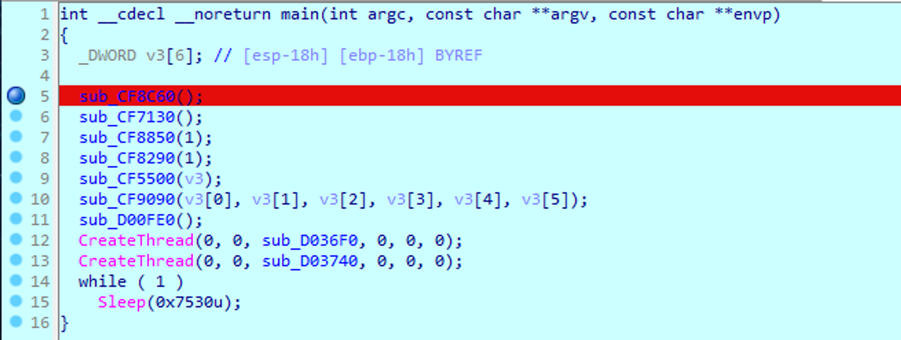

Внутри встречаются знакомые нам строки!
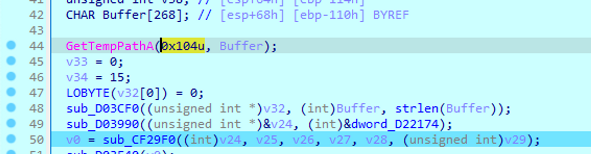

---

# Вторая попытка расшифровать строки
Вернемся к изначальному сэмплу, немного пробежавшись по коду я наткнулся на функцию, которая в аргументы принимает одну из Base64-строк. 

Вот main:
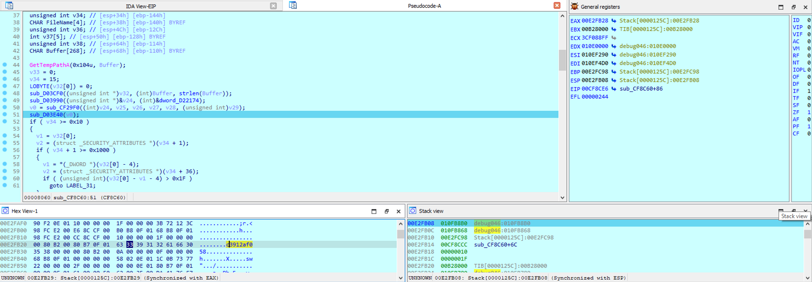

Дальше идет получение пути до временной папки пользователя и функция, про которую я вам рассказываю - CF29F0:
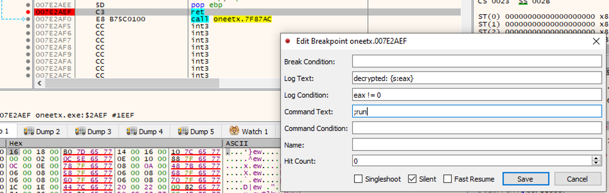

В ЕАХ передается Base64-строчка, но что на выходе? А на выходе название папки, в который себя копирует сэмпл - c3912af058!
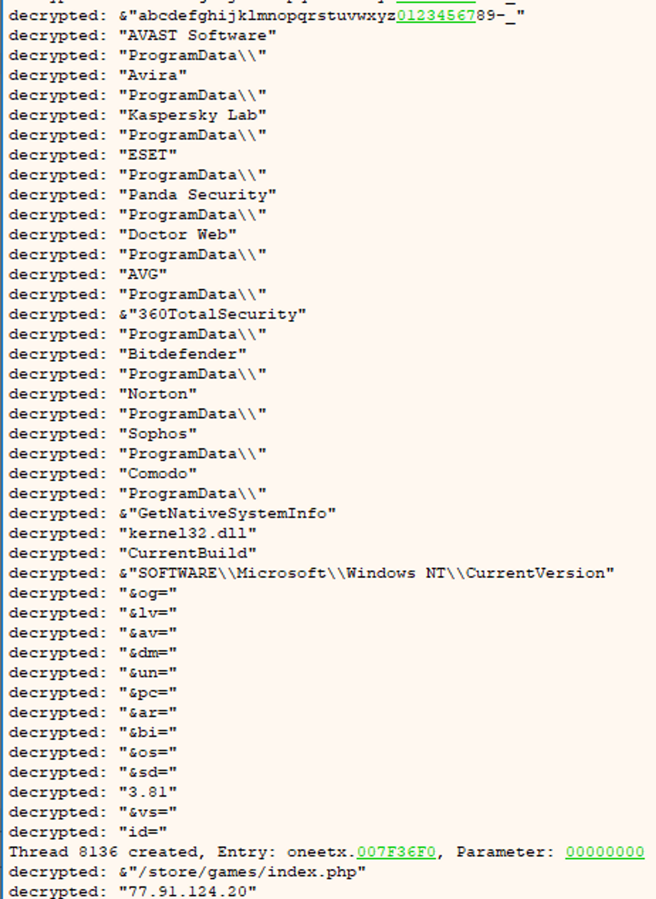

Думаю, мы нашли что искали. Дело за малым, запуститься из этой директории и повторить трюк с x32dbg из начала статьи, а именно - поставить conditional break на retn и выводить результат ЕАХ в лог.

Что ж, прямое попадание, тут и C2, и названия антивирусов (видимо анти-АВ модуль вшит), и команды которые запускаются для закрепления выше есть… Нашли что искали. Но как быть с клиппером?

---

# Заключение
На этом я заканчиваю свою статью с анализом образца Amadey. 

Обнаружив С2, можно найти другие образцы этой вредоносной кампании, проверить на них собственные YARA-правила для конкретного семейства. Также, имея в запасе кипу образцов, можно попробовать написать правила для IDS разобрав структуру URL-адресов. В конце концов, можно автоматизировать весь процесс и извлекать С2 массово.
